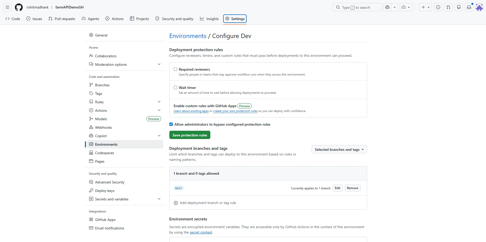
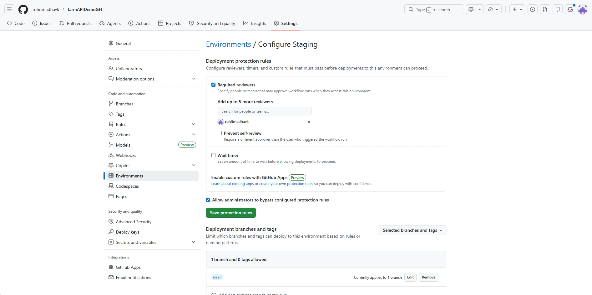
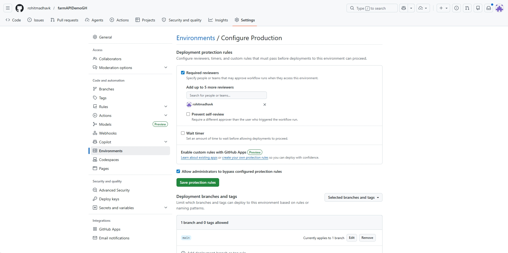
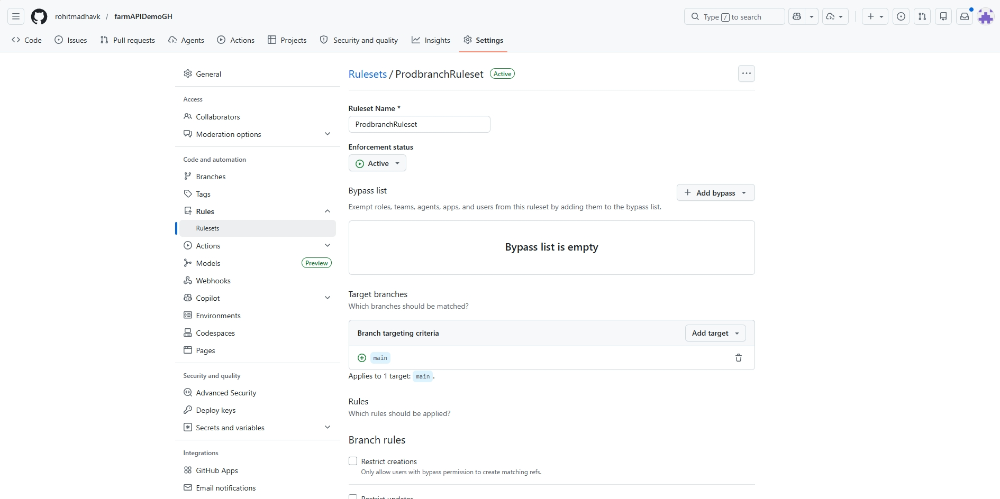
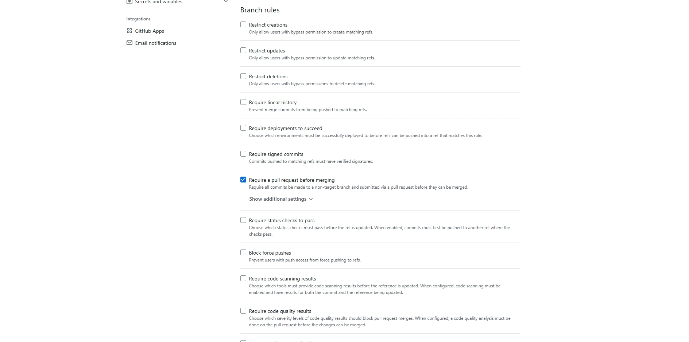
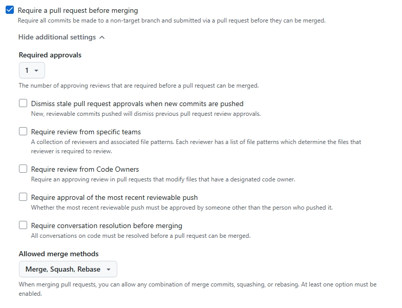

[](https://github.com/rohitmadhavk/farmAPIDemoGH/actions/workflows/build-action.yml)
[](https://github.com/rohitmadhavk/farmAPIDemoGH/releases/latest)

# FarmAPI Demo
 
A .NET 9 REST API demonstration project showcasing GitHub Copilot integration and CI/CD automation with GitHub Actions.
**FarmAPI** is a simple farm animal management API used to demonstrate:
- **REST API** with endpoints for managing farm animals (GET, POST, DELETE)
- **Swagger UI** for interactive API testing
- **Automated Workflow** that builds and tests on every push
    - CI/CD pipeline with GitHub Actions
        - Sequential deployment to environments
        - Branch protection
- **Tagged Releases** with **custom workflow naming**

# Contents
- [Quick Start](#quick-start)

    - [API Quick Start](#api-quick-start) 
        - [Prerequisites](#prerequisites)
    - [Workflows Quick Start](#workflow-quick-start) 

 
## Quick Start

### API Quick Start
#### Prerequisites
- [.NET 9 SDK](https://dotnet.microsoft.com/en-us/download)
- [git](https://git-scm.com/)

```bash
# Clone and setup
git clone <repository-url>
cd farmdemo
dotnet restore

# Run tests
dotnet test
 
# Run the app
dotnet run
 
# Access Swagger UI
```
 
#### API Endpoints
 
- `GET /animals` - List all animals
- `POST /animals` - Add new animal (validates species)
- `GET /animals/species/{species}` - Get all animals of a certain species
- `DELETE /animals/{name}` - Remove animal
 
Valid species: Cow, Sheep, Lamb, Chicken, Goat, Pig
 
### Workflow Quick Start
#### GitHub Copilot Configuration
 
##### Environment-Specific Protection Rules
 
Configure these in your GitHub organization or repository settings:
 
###### Development Environment
- Rule 1: **Untick** box 'Required Reviewers'
- Rule 2: **Tick** box 'Allow administrators to bypass configured protection rules

 
###### Staging Environment
- Rule 1: **Tick** box 'Required Reviewers'
- Rule 2: **Tick** box 'Allow administrators to bypass configured protection rules

 
###### Production Environment
- Rule 1: **Tick** box 'Required Reviewers'
- Rule 2: **Tick** box 'Allow administrators to bypass configured protection rules

 
###### Rulesets
- Add a branch protection ruleset
- Target branch should be main
- Tick box 'Require a pull request before merging'
- Set number of approvals to **1**



 

#### Trigger Workflow Run
The CI/CD pipeline automatically runs on every push:

```bash
# Regular commit - workflow shows: "Building App"
git commit -a -m "Cleaning workflow files - Pt2"
git push
 
# Tagged release - workflow shows: "[v1.4.3] [Release message] Building App"
git tag -a v1.4.3 -m "Removed hashtag into workflow file"
git push origin v1.4.3
```
 

 